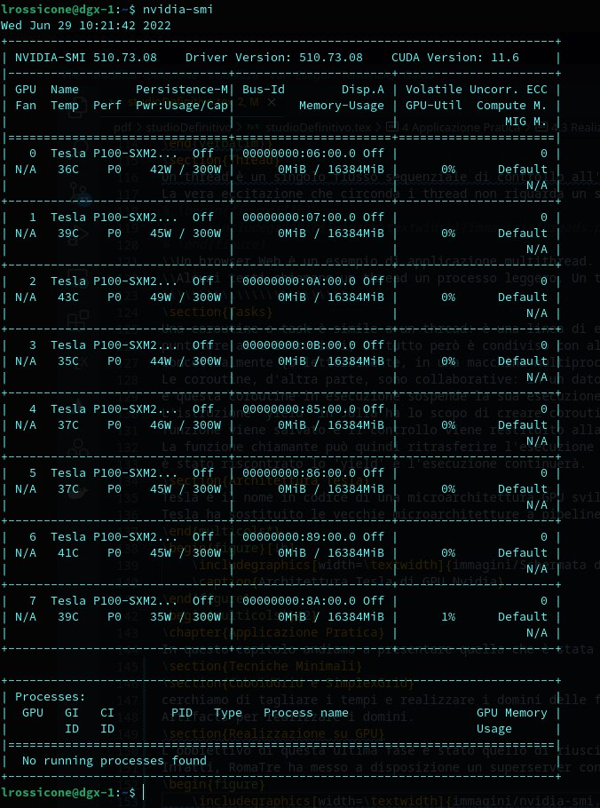
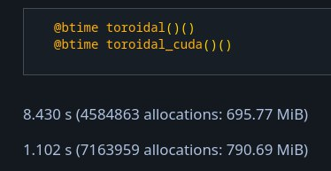

# Applicazione Pratica

In questo capitolo andiamo a presentare quella che è stata la nostra
esperienza: i nostri esperimenti, tentativi falliti e riusciti, quesiti
aperti e altro.

## Tecniche Minimali

Inizialmente le tecniche che abbiamo adoperato sono state tratte dal
libro \"Julia High Performance: Optimizations, distributed computing,
multithreading, and GPU programming with Julia 1.0 and
beyond\" [@julia]. Purtroppo questo tentativo è stato fallimentare: non
abbiamo registrato miglioramenti significativi, o non ne abbiamo
registrati affatto.

## CuboidGrid e SimplexGrid

In questa seconda fase abbiamo cercato di ridurre i tempi di esecuzione
tranne la realizzazione di domini di funzioni esterni al codice. La
nostra idea era quella di utilizzare dei file di configurazione per
poter ridurre i tempi di calcolo a discapito dei tempi di caricamento.
Questo è stato possibile tramite il package Julia `Artifacts.jl`, ma si
è rivelata una soluzione solo parzialmente efficace.

## Realizzazione su GPU

L'obbiettivo di questa ultima fase è stato quello di riuscire a
trasportare il calcolo di queste funzioni dalla CPU alla GPU Nvidia
fornita dal nostro ateneo. Infatti, RomaTre ha messo a disposizione un
superserver con circa 8 schede grafiche per agevolare i nostri test. Di
seguito abbiamo inserito una foto dell'esecuzione del comando
`nvidia-smi`:

2 Questa trasformazione in buona sostanza consiste nel passaggio dalla
struttura dati `QArray` al posto della struttura `Array`. I benchmark
eseguiti e i test effettuati sulla versione finale del progetto
riportano risultati incoraggianti, i quali sono riportati sia sul
notebook che di seguito, dimostrano che i tempi di esecuzione, per la
memoria occupata, sono molto buoni ed incoraggianti:

