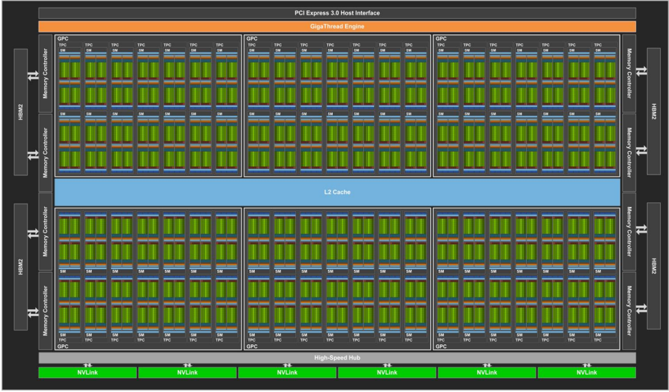

# Background Tecnologico

In questo progetto abbiamo fatto uso di diverse tecnologie, a partire
dal linguaggio Julia, utilizzato per implementare tutto quanto, passando
poi per gli elementi principali della programmazione, come i task, il
multithreading e infine implementando tutto in modo tale da sfruttare la
potenza di calcolo di una GPU NVidia.

## Julia

Julia è un linguaggio di programmazione dinamico di alto livello, ad
alte prestazioni. Sebbene sia un linguaggio generico e possa essere
utilizzato per scrivere qualsiasi applicazione, molte delle sue
caratteristiche sono adatte per l'analisi numerica e la scienza
computazionale. Aspetti distintivi del design di Julia includono un
sistema di tipi con polimorfismo parametrico in un linguaggio di
programmazione dinamico; con invio multiplo come paradigma di
programmazione principale. Julia supporta l'elaborazione simultanea,
parallela (componibile) e distribuita (con o senza l'utilizzo di MPI o
il corrispondente integrato ai thread \"stile OpenMP\") e la chiamata
diretta di C e librerie Fortran senza codice colla. Julia utilizza un
compilatore just-in-time (JIT) denominato \"just-ahead-of-time\" (JAOT)
nella community di Julia, poiché Julia compila tutto il codice (per
impostazione predefinita) in codice macchina prima di eseguirlo. Julia è
raccolta di rifiuti, utilizza la valutazione desiderosa e include
librerie efficienti per calcoli a virgola mobile, algebra lineare,
generazione di numeri casuali e corrispondenza di espressioni regolari.
Sono disponibili molte librerie, incluse alcune (ad es. per
trasformazioni di Fourier veloci) che erano state precedentemente
fornite in bundle con Julia e ora sono separate. Diversi strumenti di
sviluppo supportano la codifica in Julia, come ambienti di sviluppo
integrati (ad es. Visual Studio Code di Microsoft, con estensioni
disponibili che aggiungono il supporto di Julia agli IDE, ad es.
fornendo supporto per debug e linting); con strumenti integrati, ad es.
un profiler (e il supporto per i grafici di fiamma disponibili per
quello integrato), un debugger e il pacchetto Rebugger.jl \"supporta il
debug a esecuzione ripetuta\" e altro ancora.

## Julia Artifacts

Gli artefatti[@artifacts] in Julia esistono sotto forma di un modulo
all'interno del modulo Pkg chiamato Pkg.Artifacts. Si accede alla
funzionalità nel REPL tramite:

     julia> using Pkg.Artifacts    

Se inserire immagini, file binari, set di dati e dati simili nei
repository git fosse indolore e senza problemi, potremmo non aver
bisogno di Artifacts.\
Il problema è che per i file binari i requisiti di spazio possono
diventare eccessivi abbastanza rapidamente. Compilare una versione per
ogni piattaforma, 32-bit, 64-bit e una moltitudine di altre varianti e
mantenerla nella libreria del codice sorgente è una pratica troppo
onerosa: ci vorrebbe troppo spazio.\
Con Artifacts, più pacchetti potrebbero in linea di principio utilizzare
gli stessi dati e non è necessario scaricarli due volte. Facciamo conto
che il pacchetto A e il pacchetto B, entrambi dipendono dalla libreria
Qt. La soluzione fittizia a questo è che entrambe le librerie
memorizzino una copia di Qt.\
Bisognerebbe quindi scaricare un'enorme libreria due volte sprecando il
doppio dello spazio sul disco rigido. Non è una buona soluzione. Ora
qualcun altro potrebbe pensare di essere intelligente e archiviare Qt in
una directory condivisa per entrambi i pacchetti da usare. Vari sistemi
operativi lo hanno fatto all'inizio e hanno creato la cosa divertente
che chiamiamo \"inferno DLL\". Ciò accade quando la versione Qt
richiesta non è proprio la stessa. La versione scaricabile Qt potrebbe
funzionare per A, ma non per B.\
Git ha reso popolare una soluzione a questo enigma chiamato dati
indirizzabili al contenuto. Ciò significa che non localizzano i dati
fornendo percorsi come `A/libs/Qt`, ma usiamo invece degli hash.\
In questo caso, ogni byte dei binari della libreria Qt viene inserito in
un algoritmo di hashing e crea un numero univoco, l'hash. In teoria,
ovviamente, non è possibile garantire che due set di dati producano hash
diversi. La possibilità che diversi set di dati producano lo stesso hash
è simile a quella di due persone in posizioni casuali sulla terra che
raccolgono lo stesso granello di sabbia. Potrebbe succedere, ma è
improbabile.\
Il sistema di pacchetti Julia può quindi verificare se una libreria è
stata già installata controllando se esiste già una directory con un
hash ed evitare di scaricare la stessa libreria una seconda volta.\
Un altro problema risolto con Artifacts è che si evita di gonfiare il
proprio repository con file binari. Supponiamo che tu abbia un pacchetto
`Museo` con il codice per mostrare i `quadri`. Invece di inserire una
directory `quadri` nel repository del pacchetto con le immagini di ogni
opera d'arte, crei un file `Artifacts.toml`. In esso descrivi dove si
trovano le varie immagini in una maniera simile a questa:

        # Museo/Artifacts.toml 
        [pictures]
        git-tree-sha1 = "c5f4d31e5c9c5d6fba2469ceff3d9916050d92d2"
        lazy = true

        [[pictures.download]]
        sha256 = "2aea399ab3c6b6e3a4285ec6ae31b858803442bf1b3e3e4889a2e3e8287d56c6"
        url = "https://github.com/johndoe/Museo.jl/releases/download/pictures.tar.gz"

## Thread

Un thread è un singolo flusso sequenziale di controllo all'interno di un
programma. [@threads]\
La vera eccitazione che circonda i thread non riguarda un singolo thread
sequenziale. Piuttosto, si tratta dell'uso di più thread in esecuzione
contemporaneamente ed eseguire attività diverse in un unico programma.
Questo uso è illustrato nella figura successiva.\
Un browser Web è un esempio di applicazione multithread. All'interno di
un browser tipico, puoi scorrere una pagina mentre sta scaricando
un'applet o un'immagine, riprodurre animazioni e suoni
contemporaneamente, stampare una pagina in background mentre scarichi
una nuova pagina o guardare tre algoritmi di ordinamento che corrono
verso il traguardo.\
Alcuni testi chiamano un thread un processo leggero. Un thread è simile
a un processo reale in quanto entrambi hanno un unico flusso sequenziale
di controllo. Tuttavia, un thread è considerato leggero perché viene
eseguito nel contesto di un programma completo e sfrutta le risorse
allocate per quel programma e l'ambiente del programma.
 

## Tasks

Una coroutine o task è simile a un thread: è una linea di esecuzione,
con il proprio stack, le proprie variabili locali e il proprio puntatore
alle istruzioni; il tutto però è condiviso con altre coroutine. La
principale differenza tra thread e coroutine è che, concettualmente (o
letteralmente, in una macchina multiprocessore), un programma con thread
esegue diversi thread in parallelo. Le coroutine, d'altra parte, sono
collaborative: in un dato momento, un programma con coroutine esegue
solo una delle sue coroutine e questa coroutine in esecuzione sospende
la sua esecuzione solo quando richiede esplicitamente di essere
sospesa. [@tasks]\
L'istruzione 'yield' in Julia ha lo scopo di creare coroutine. Quando si
incontra l'istruzione 'yield', lo stato corrente della funzione viene
salvato e il controllo viene restituito alla funzione chiamante. La
funzione chiamante può quindi ritrasferire l'esecuzione alla funzione
cedente e il suo stato verrà ripristinato al punto in cui è stato
riscontrato lo 'yield' e l'esecuzione continuerà.

## Architettura Tesla

Tesla è il nome in codice di una microarchitettura GPU sviluppata da
Nvidia e rilasciata nel 2006, come successore della microarchitettura
Curie. Prende il nome dal pioniere dell'ingegnere elettrico Nikola
Tesla. Come prima microarchitettura di Nvidia a implementare gli shader
unificati, è stata utilizzata con GeForce serie 8, GeForce serie 9,
serie GeForce 100, serie GeForce 200 e serie GeForce 300 di GPU prodotte
collettivamente in 90 nm, 80 nm, 65 nm, 55 nm, e 40 nm. Era anche nella
GeForce 405 e nei moduli di elaborazione Quadro FX, Quadro x000, Quadro
NVS e Nvidia Tesla. Tesla ha sostituito le vecchie microarchitetture a
pipeline fissa, rappresentate al momento dell'introduzione dalla serie
GeForce 7. Ha gareggiato direttamente con la prima microarchitettura
shader unificata di AMD denominata TeraScale, uno sviluppo del lavoro di
ATI su Xbox 360 che utilizzava un design simile. Tesla è stato seguito
da Fermi.

