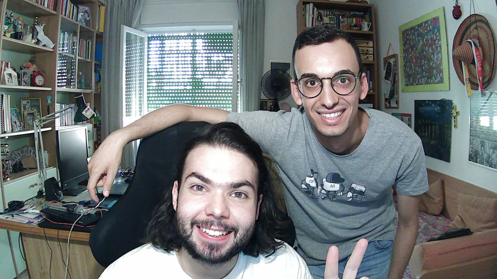

# Informazioni generali

Progetto **LAR Generators** per il corso di **Calcolo Parallelo e Distribuito** svolto da:

| Nome| Matricola | E-mail | Profilo Github |
|:---|:---|:---|:---|
|Filippo Iacobelli|582898|fil.iacobelli@stud.uniroma3.it| [https://github.com/ZoSo9999/](https://github.com/ZoSo9999/) |
| Luca Rossicone |523938|luc.rossicone@stud.uniroma3.it|[https://github.com/Asprofumo/](https://github.com/Asprofumo/)|

## Gli sviluppatori



Link al repository GitHub: [https://github.com/Asprofumo/Mapper.jl/](https://github.com/Asprofumo/Mapper.jl/)

# Indice

```@contents
Pages = ["intro.md", "stateart.md", "indice.md", "grafodipendenze.md","background.md","applicazione.md","conclusioni.md","lar.md","mapper.md"]
Depth = 3
```