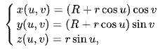

# Introduzione

Linear Algebric Representation (d'ora in avanti LAR) LAR è uno schema
di rappresentazione generale per la modellazione geometrica e topologica
(vedi \"Rappresentazione algebrica lineare per strutture topologiche\").
Il dominio dello schema è fornito da complessi cellulari mentre il suo
codominio è un insieme di matrici sparse. Altro non è che un package
scritto in linguaggio Julia per il calcolo geometrico di figure piane e
solide. Essa fa uso della API (Application Programming Interface)
[ViewerGL](https://github.com/cvdlab/ViewerGL.jl), sviluppato dalla
nostra università da una fork di
[Plasm.jl](https://github.com/plasm-language/pyplasm/tree/master/src/plasm.jl).

## Matrici Sparse

Nell'analisi numerica e nel calcolo scientifico, una matrice sparsa o un
array sparso è una matrice in cui la maggior parte degli elementi è
zero. Non esiste una definizione rigida per quanto riguarda la
proporzione di elementi con valore zero affinché una matrice si
qualifichi come sparsa, ma un criterio comune è che il numero di
elementi diversi da zero è all'incirca uguale al numero di righe o
colonne. Al contrario, se la maggior parte degli elementi è diversa da
zero, la matrice è considerata densa. Il numero di elementi di valore
zero diviso per il numero totale di elementi (ad esempio, m × n per una
matrice m × n) è talvolta indicato come la scarsità della matrice.

## Complessi di Celle

Una cella n-dimensionale chiusa è uno spazio topologico che è omeomorfo
ad una palla chiusa n-dimensionale. Per esempio, un simplesso è una
cella chiusa, e più in generale, un politopo convesso è una cella
chiusa. Una cella n-dimensionale aperta è uno spazio topologico
omeomorfo alla palla aperta n-dimensionale. Una cella 0-dimensionale
aperta (e chiusa) è un punto. Informalmente, un complesso di celle è uno
spazio topologico ottenuto incollando fra loro un certo numero di celle
chiuse. Formalmente, un complesso di celle è uno spazio di Hausdorff
**$\chi$** dotato di una partizione in celle aperte (di dimensioni
variabili) che soddisfa due proprietà:

1.  Per ogni cella n-dimensionale aperta C nella partizione di X, esiste
    una mappa continua f della palla n-dimensionale chiusa su X tale che

    -   la restrizione di f all'interno della palla chiusa è un
        omeomorfismo sulla cella C, e

    -   l'immagine del contorno della palla chiusa è contenuta
        nell'unione di un numero finito di celle aventi tutte dimensione
        inferiore ad n.

2.  Un sottoinsieme di X è chiuso se e soltanto se incontra la chiusura
    di ciascuna cella in un insieme chiuso.

Il termine CW-complesso, mutuato dall'inglese, è a volte usato come
sinonimo di complesso di celle. Le lettere C e W indicano i termini
inglesi closure-finite e weak-topology e si riferiscono alle due
proprietà elencate (la seconda proprietà infatti indica che la topologia
su X è in un certo senso una topologia debole).

## Illustrazione delle principali primitive

In questa sezione vengono descritte le principali primitive contenute nel package `mapper.jl` oggetto del lavoro di ottimizzazione previsto dal progetto.

### Lar.approxVal
Lo scopo di questa funzione è molto semplice: fornendo in input un valore e un numero di cifre significative approssima il valore al numero di cifre richieste. Qualora il risultato fosse `-0.0` il segno viene cambiato.

### Lar.simplifyCells
A causa di errori numerici sulle coordinate mappate potrebbero verificarsi duplicazioni di vertici. Questa funzione ausiliaria trova ed elimina vertici duplicati e celle errate.
I paramentri di input sono CV (vettore di vettori) e V (matrice).  
Viene creato un dizionario vertDict con chiave una colonne della matrice e valore un contatore incrementale.
Per ogni vettore incell di CV la funzione crea un vettore vuoto outcell e per ogni elemento di v di incell preleva la colonna corrispondente di V. Applica la funzione `approxVal` ad ogni elemento della colonna.  
Se la colonna non è presente nel dizionario, incrementa l'indice e la inserisce nel dizionario con chiave il nuovo valore dell'indice. Inoltre aggiunge l'indice ad outcell e la colonna alla matrice W di output.  
Se invece la colonna appartiene già al dizionario, aggiunge ad outcell l'indice corrispondente presente nel dizionario.
Infine l'eliminazione dei duplicati da outcell avviene mediante la creazione di un `Set` che per definizione non può contenere valori uguali.

### Lar.circle
Calcola l'approssimazione di una circonferenza centrata nell'origine prendendo come input raggio, angolo e numero di segmenti utilizzati per l'approssimazione.
Per la creazione di vertici e spigoli sfrutta la funzione `cuboidGrid` descritta nel modulo `largrid.jl`.  
La funzione moltiplica ogni vertice per il rapporto fra l'angolo e i segmenti inseriti in input. 
Mappa ogni vertice come segue:

e inserisce le coppie così generate in un vettore. Dopodiché affianca ogni vettore ottenendo una matrice con un numero di elementi doppi rispetto alla precedente.  
Infine applica `simplifyCells` al risultato.

### Lar.toroidal
Calcola una approssimazione del toro, ovvero una superficie di rotazione ottenuta dalla rivoluzione di una circonferenza in uno spazio tridimensionale intorno a un asse ad essa complanare. Gli input richiesti sono raggio e angolo della circonferenza e della superficie di rotazione, oltre al numero di segmenti richiesti per l'approssimazione.  
La descrizione della funzione è simile alla precedente. Per la creazione di vertici e spigoli sfrutta la funzione `simplexGrid` descritta nel modulo `simplexn.jl`.  
La matrice V ottenuta possiede due righe ciascuna delle quali rappresenta i vertici di ciascuna delle due figure. Viene effettuato un prodotto fra V e una matrice 2 x 2 con il rapporto fra l'angolo e il numero segmenti inseriti in input rispettivamente per la prima e la seconda figura sulla diagonale principale e degli 0 sulla diagonale secondaria.  
Vengono estratte una per volta tutte le colonne di V mappandole nel seguente modo:

Infine applica `simplifyCells` al risultato.

### Lar.cuboid
Restituisce un cubo d-dimensionale dove d è la dimensione comune degli array di input `minpoint` e
`maxpoint`.  
Per la creazione di vertici e spigoli sfrutta la funzione `cuboidGrid` descritta nel modulo `largrid.jl`.
Dopodiché tramite le funzioni esterne `s` e `t` crea delle matrici, le moltiplica fra loro e applica la funzione esterna `apply` al risultato.